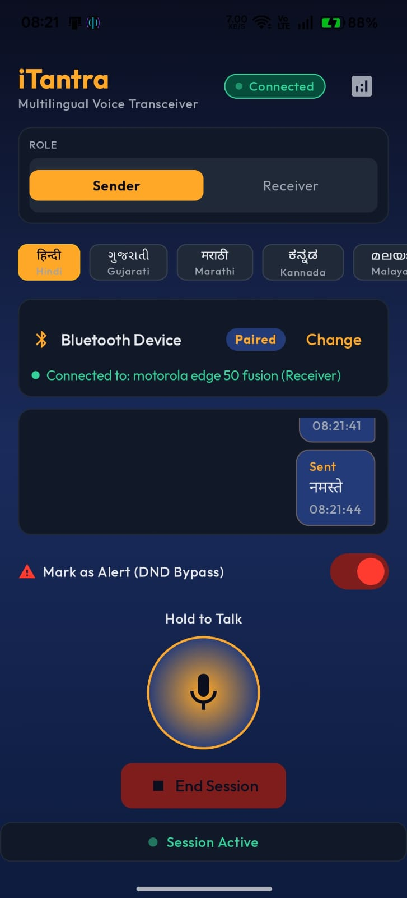
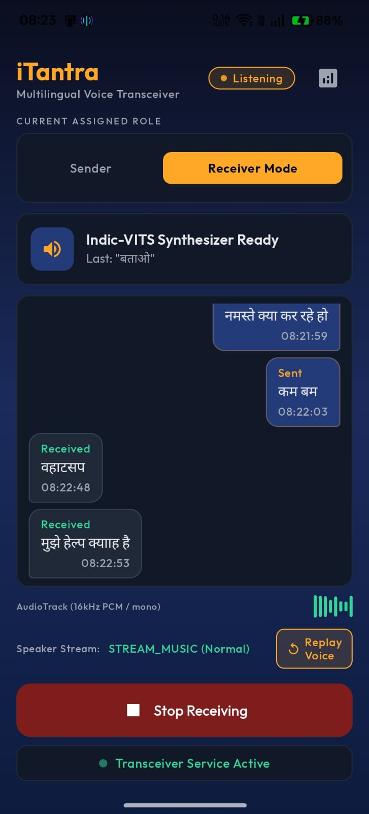

<div align="center">

# 📡 iTantra

### Indian Multilingual TTS & STT Aided Neural Transceiver

**Offline · Multilingual · Low-Bitrate Emergency Communication**

[](https://developer.android.com)
[](https://kotlinlang.org)
[](https://onnxruntime.ai)
[](https://developer.android.com/jetpack/compose)
[](LICENSE)

> **Problem Statement:** SIH26173 — Indian Space Research Organisation (ISRO), Smart India Hackathon 2026

</div>

---

## 📋 Table of Contents

- [Overview](#-overview)
- [Key Features](#-key-features)
- [App Screenshots](#-app-screenshots)
- [System Architecture](#-system-architecture)
- [Tech Stack](#-tech-stack)
- [Project Structure](#-project-structure)
- [Quick Start](#-quick-start)
  - [Prerequisites](#prerequisites)
  - [1 — Prepare ML Models](#1--prepare-ml-models)
  - [2 — Font Setup](#2--font-setup)
  - [3 — Build & Install](#3--build--install)
  - [4 — Run the Demo](#4--run-the-demo)
- [Supported Languages](#-supported-languages)
- [Performance Targets](#-performance-targets)
- [Permissions](#-permissions)
- [Evaluation Metrics](#-evaluation-metrics)
- [Implementation Status](#-implementation-status)
- [Troubleshooting](#-troubleshooting)
- [Contributing](#-contributing)

---

## 🌐 Overview

**iTantra** is an Android application that transforms two smartphones into an **offline, multilingual walkie-talkie** built for alert and distress communication over low-bitrate wireless links.

Instead of transmitting raw voice audio — which is heavy and unreliable over weak links — iTantra compresses the entire voice message into a **tiny ~50-byte text packet** using on-device AI:

1. 🎙️ **Sender** captures speech and transcribes it locally using AI4Bharat IndicConformer (STT)
2. 📦 The recognized text, language ID, and alert flag are packed into a Protocol Buffers payload
3. 📡 The packet is transmitted via **Bluetooth Classic** or **Wi-Fi Direct** — no internet required
4. 🔊 **Receiver** deserializes the payload and synthesizes natural speech using AI4Bharat Indic-VITS (TTS)

This approach makes critical communication possible where bandwidth is severely limited, while also making it **inclusive** — the message always arrives as spoken audio, reaching people regardless of literacy.

> **All processing happens on-device. No internet. No cloud. No proprietary APIs.**

---

## ✨ Key Features

| Feature | Description |
|---|---|
| 🔴 **Push-to-Talk (PTT)** | Hold button to speak; release to transmit — walkie-talkie style |
| 🎙️ **Phone Mode** | Continuous background listening with voice activity detection |
| 🚨 **Alert Override** | Forces max volume, bypasses Do Not Disturb for emergency messages |
| 🌐 **10 Indian Languages** | Hindi, Gujarati, Marathi, Kannada, Malayalam, Tamil, Telugu, Odia, Bengali, English |
| 📴 **Fully Offline** | No internet, no cloud APIs — works in airplane mode |
| 📊 **Live Diagnostics** | Real-time latency, RTF, payload size, and RAM usage panel |
| ⚡ **Tiny Payload** | ~50 bytes per message vs. ~300 KB for equivalent raw audio |
| 🔋 **Low-End Friendly** | INT8-quantized models optimized for mid-range Android devices |

---

## 📸 App Screenshots

<table>
  <tr>
    <td align="center" width="50%">
      <strong>Sender UI</strong><br/>
      <em>Push-to-Talk, language selector, live transcript, diagnostics</em><br/><br/>
      
    </td>
    <td align="center" width="50%">
      <strong>Receiver UI</strong><br/>
      <em>Session status, incoming messages, TTS playback indicator</em><br/><br/>
      
    </td>
  </tr>
</table>

---

## 🏗️ System Architecture

iTantra operates as a **linear ML pipeline** split across two devices over a wireless bridge:

```
┌──────────────────────────────────┐       ┌────────────────────────────────┐
│         SENDER PHONE             │       │        RECEIVER PHONE          │
│                                  │       │                                │
│  🎙️  AudioRecord (16kHz mono)    │       │   🔊 AudioTrack Playback       │
│        ↓                         │       │        ↑                       │
│  🔍  Silero VAD                  │       │   🗣️  Indic-VITS TTS Engine    │
│      (~30ms frames)              │       │      (ONNX Runtime)            │
│        ↓                         │       │        ↑                       │
│  📝  IndicConformer STT          │       │   📦  Protobuf Deserialize     │
│      (ONNX Runtime, INT8)        │       │        ↑                       │
│        ↓                         │       │        │                       │
│  📦  Protobuf Serialize          │       │        │                       │
│      (text + lang + alert flag)  │       │        │                       │
│        ↓  ~50 bytes              │       │        │                       │
│                                  │ ───── │ ───────┘                       │
│              Bluetooth RFCOMM / Wi-Fi Direct                              │
└──────────────────────────────────┘       └────────────────────────────────┘
```

### Four Core Subsystems

| # | Subsystem | Role | Key Components |
|---|---|---|---|
| 1 | **Audio Ingestion & VAD** | Gatekeeper — only routes real speech to STT | `AudioRecord`, Silero VAD, `VadManager.kt` |
| 2 | **Edge STT Engine** | Encoder — converts audio to text on-device | IndicConformer (ONNX, INT8), `SttEngine.kt` |
| 3 | **Network Serialization & Transmission** | Bridge — sends meaning, not audio | Protobuf Lite, `BluetoothTransceiver.kt` |
| 4 | **Edge TTS Engine & Playback** | Decoder — synthesizes speech and plays it back | Indic-VITS (ONNX, INT8), `TtsEngine.kt`, `AudioTrack` |

---

## 🛠️ Tech Stack

| Component | Technology | Rationale |
|---|---|---|
| **App Framework** | Android (Kotlin, API 29–35) | Modern Android, Coroutines for async pipelines |
| **UI Layer** | Jetpack Compose + Material 3 | Declarative, reactive UI |
| **ML Runtime** | ONNX Runtime Mobile (Java API) | Lightweight, built for on-device inference |
| **Speech-to-Text** | AI4Bharat IndicConformer | Best open-source STT accuracy for 10 Indian languages |
| **Text-to-Speech** | AI4Bharat Indic-VITS | Efficient, high-quality TTS with fast RTF |
| **Voice Activity Detection** | Silero VAD (ONNX) | ~1ms latency, <1MB RAM footprint |
| **Connectivity** | Bluetooth Classic (RFCOMM) + Wi-Fi Direct | Low-bitrate text transport, no router needed |
| **Serialization** | Protocol Buffers (Protobuf Lite) | Compact binary payload, ~50 bytes per message |
| **Model Quantization** | ONNX INT8 Dynamic Quantization | 4× model size reduction (180MB → ~45MB) |
| **Build System** | Gradle (Kotlin DSL) | Type-safe, modern build configuration |
| **Model Scripts** | Python 3.10+, NeMo, HuggingFace Hub | Model download, export, and quantization pipeline |

---

## 📁 Project Structure

```
iTantra/
├── app/
│   ├── build.gradle.kts                    ← App build config (Kotlin DSL)
│   ├── libs/                               ← Local AAR files (sherpa-onnx-*.aar)
│   ├── proguard-rules.pro
│   └── src/main/
│       ├── AndroidManifest.xml             ← Permissions & service declarations
│       ├── assets/                         ← ONNX model files (populated by scripts)
│       │   ├── vad_silero.onnx             ← Silero VAD model (~2MB)
│       │   ├── stt_hi.onnx                 ← IndicConformer STT, Hindi (~45MB)
│       │   └── tts_hi.onnx                 ← Indic-VITS TTS, Hindi (~45MB)
│       ├── proto/
│       │   └── message.proto               ← Protobuf wire format schema
│       ├── jniLibs/arm64-v8a/             ← Native ONNX Runtime .so libraries
│       └── java/com/itantra/
│           ├── MainActivity.kt             ← App entry point
│           ├── audio/
│           │   ├── AudioIngestion.kt       ← AudioRecord capture (16kHz mono PCM)
│           │   ├── AudioPlayback.kt        ← AudioTrack playback
│           │   ├── MelSpectrogram.kt       ← Mel-filterbank feature extraction
│           │   └── VadManager.kt           ← Silero VAD integration
│           ├── network/
│           │   ├── BluetoothTransceiver.kt ← Bluetooth RFCOMM client/server
│           │   └── PayloadSerializer.kt    ← Protobuf encode/decode helpers
│           ├── stt/
│           │   ├── SttEngine.kt            ← STT interface / base class
│           │   └── SherpaSttEngine.kt      ← Sherpa-ONNX backed STT impl
│           ├── tts/
│           │   └── TtsEngine.kt            ← Indic-VITS TTS inference wrapper
│           ├── model/                      ← Data models and domain types
│           ├── service/
│           │   └── TransceiverService.kt   ← Foreground service, pipeline orchestrator
│           └── ui/
│               ├── MainViewModel.kt        ← Compose ViewModel, state holder
│               ├── screens/
│               │   └── HomeScreen.kt       ← PTT, role selector, diagnostics
│               └── theme/                  ← Material 3 colors, typography, shapes
├── scripts/
│   ├── download_models.py                  ← Fetch AI4Bharat weights from HuggingFace
│   ├── download_sherpa_models.py           ← Fetch Sherpa-ONNX AAR and models
│   ├── convert_to_onnx.py                  ← Export PyTorch checkpoints to ONNX
│   └── quantize_models.py                  ← INT8 quantize & copy to assets/
├── assets/
│   ├── sender_ui.jpeg                      ← Sender UI screenshot
│   └── receiver_ui.jpeg                    ← Receiver UI screenshot
├── models/                                 ← Intermediate model files (git-ignored)
├── gradle/
│   └── libs.versions.toml                  ← Version catalog
├── build.gradle.kts                        ← Root build script
├── settings.gradle.kts                     ← Project settings
├── gradle.properties                       ← Gradle JVM & Android flags
├── SETUP.md                                ← Detailed environment setup guide
└── README.md                               ← This file
```

---

## 🚀 Quick Start

> **Full step-by-step setup with troubleshooting:** See [SETUP.md](SETUP.md)

### Prerequisites

**Hardware:**
- Development laptop (Windows 10/11, 16 GB RAM recommended)
- Two Android phones — API 29+ (Android 10+), working mic and speaker
- USB-C cables (one per phone) for ADB

**Software:**

| Tool | Version | Notes |
|---|---|---|
| Python | 3.10 or 3.11 | Check "Add Python to PATH" during install |
| Android Studio | Koala (2024.1)+ | Includes JDK 17 and Android SDK |
| Git | Latest | — |

---

### 1 — Prepare ML Models

Open a terminal in the project root and run:

```powershell
# Create & activate a Python virtual environment
python -m venv venv
.\venv\Scripts\Activate.ps1

# Install model pipeline dependencies
pip install huggingface_hub onnxruntime onnx numpy
pip install torch torchaudio --index-url https://download.pytorch.org/whl/cpu
pip install nemo_toolkit[asr] nemo_toolkit[tts]
```

**Download, convert, and quantize models (Hindi MVP):**

```powershell
# Step 1 — Download AI4Bharat weights from HuggingFace (~400 MB)
python scripts/download_models.py --langs hi

# Step 2 — Export PyTorch checkpoints to ONNX format
python scripts/convert_to_onnx.py --lang hi

# Step 3 — INT8 quantize (4x compression) and copy to app assets
python scripts/quantize_models.py --lang hi
```

After Step 3 you should see:

```
app/src/main/assets/
  vad_silero.onnx    (~2 MB)
  stt_hi.onnx        (~45 MB)
  tts_hi.onnx        (~45 MB)
```

**Verify the quantized models:**

```powershell
python scripts/quantize_models.py --verify hi
# ✓ STT verify OK — output shape: (1, 42)
# ✓ TTS verify OK — output shape: (1, 1, 88200)
```

**Add more languages:**

```powershell
# Multiple languages
python scripts/download_models.py --langs hi gu mr kn

# All 10 supported languages (~4 GB total)
python scripts/download_models.py --all
```

---

### 2 — Font Setup

The UI uses the **Outfit** typeface from Google Fonts.

1. Download from: **https://fonts.google.com/specimen/Outfit** → "Download family"
2. Create the font directory: `app/src/main/res/font/`
3. Copy and rename the TTF files:

| Source (from ZIP) | Destination in project |
|---|---|
| `Outfit-Regular.ttf` | `app/src/main/res/font/outfit_regular.ttf` |
| `Outfit-Medium.ttf` | `app/src/main/res/font/outfit_medium.ttf` |
| `Outfit-SemiBold.ttf` | `app/src/main/res/font/outfit_semibold.ttf` |
| `Outfit-Bold.ttf` | `app/src/main/res/font/outfit_bold.ttf` |

> **Skipping fonts?** The app will crash with `FontInflateException`. Temporarily replace `OutfitFamily` with `FontFamily.Default` in `Type.kt` to bypass.

---

### 3 — Build & Install

1. Open the project root in **Android Studio**
2. Wait for Gradle sync to complete (**File → Sync Project with Gradle Files**)
3. Enable **USB Debugging** on both phones (Settings → About Phone → tap Build Number 7×)
4. Connect both phones via USB

```powershell
# Install on all connected devices
.\gradlew :app:installDebug
```

---

### 4 — Run the Demo

#### Optimal Demo Setup (Airplane Mode)

Enable Airplane Mode on both phones, then **re-enable Bluetooth only** — this visibly proves no internet is used.

#### Step-by-Step

| Step | Receiver Phone | Sender Phone |
|---|---|---|
| **1** | Open iTantra | Open iTantra |
| **2** | Grant all permissions | Grant all permissions |
| **3** | Set **Role → Receiver** | Set **Role → Sender** |
| **4** | Set **Language → Hindi** | Set **Language → Hindi** |
| **5** | Tap **"Start Session"** | Tap **"Select Device"** → choose Receiver |
| **6** | — | Tap **"Start Session"** |
| **7** | Wait for 🟢 Active status | Wait for 🟢 Active status |
| **8** | Listen for synthesized speech | Hold PTT → speak → release |

#### Test Alert Override

Toggle **"Mark as Alert"** on the Sender before speaking. The Receiver will:
- Jump to **maximum volume**
- Override **Do Not Disturb**
- Play the message using alarm-level audio priority

---

## 🌍 Supported Languages

| Code | Language | Script |
|---|---|---|
| `hi` | Hindi | देवनागरी |
| `gu` | Gujarati | ગુજરાતી |
| `mr` | Marathi | मराठी |
| `kn` | Kannada | ಕನ್ನಡ |
| `ml` | Malayalam | മലയാളം |
| `ta` | Tamil | தமிழ் |
| `te` | Telugu | తెలుగు |
| `or` | Odia | ଓଡ଼ିଆ |
| `bn` | Bengali | বাংলা |
| `en` | English | Latin |

---

## 📊 Performance Targets

| Metric | Target | Measurement Point |
|---|---|---|
| STT Latency | < 1,500 ms | Speech end → text ready |
| TTS Latency | < 1,000 ms | Text received → audio begins |
| Real-Time Factor (RTF) | < 1.00 | TTS synthesis faster than real-time playback |
| Payload Size | < 50 bytes | Protobuf-encoded message |
| End-to-End Latency | < 3,000 ms | Spoken word → heard on Receiver |

> View live stats during a session by tapping the **◉** analytics icon in the top-right of the app.

**Reference Hardware:** Snapdragon 6-series or MediaTek Helio G-series, 4 GB RAM, Android 10+

---

## 🔐 Permissions

| Permission | Used For |
|---|---|
| `RECORD_AUDIO` | Microphone capture on Sender |
| `MODIFY_AUDIO_SETTINGS` | Alert volume override |
| `BLUETOOTH`, `BLUETOOTH_ADMIN` | Bluetooth classic (legacy API) |
| `BLUETOOTH_CONNECT`, `BLUETOOTH_SCAN`, `BLUETOOTH_ADVERTISE` | Bluetooth on Android 12+ |
| `ACCESS_WIFI_STATE`, `CHANGE_WIFI_STATE` | Wi-Fi Direct transport |
| `ACCESS_FINE_LOCATION` | Required by Wi-Fi Direct / BLE scan on Android |
| `FOREGROUND_SERVICE` | Background transceiver service |
| `ACCESS_NOTIFICATION_POLICY` | Do Not Disturb override for alerts |
| `POST_NOTIFICATIONS` | Persistent foreground service notification |
| `WAKE_LOCK` | Keep CPU alive during active transmission |

---

## 📈 Evaluation Metrics

| Metric | Weight | What's Measured |
|---|---|---|
| **Accuracy** | 40% | Word Error Rate (STT), speech intelligibility & naturalness (TTS) |
| **Latency** | 20% | STT latency, TTS latency, End-to-end RTF |
| **Efficiency** | 20% | Model size, app footprint, idle CPU usage |
| **Robustness** | 20% | Solution completeness, constraint adherence, offline reliability |

---

## ✅ Implementation Status

### Complete ✅
- [x] Bluetooth RFCOMM transceiver (client + server, auto-reconnect)
- [x] Silero VAD pipeline with 30ms frame analysis and 500ms silence timeout
- [x] IndicConformer STT model inference via ONNX Runtime
- [x] Indic-VITS TTS model inference via ONNX Runtime
- [x] Protobuf Lite serialization schema (`message.proto`)
- [x] Alert override — DND bypass, max volume, `USAGE_ALARM` audio focus
- [x] Jetpack Compose UI — PTT button, role selector, language picker, live diagnostics
- [x] Python model pipeline — download, ONNX export, INT8 quantization
- [x] Foreground service with persistent notification
- [x] MelSpectrogram feature extraction for STT input

### Incomplete ❌
- [ ] **STT Decoder** — SentencePiece decoder to convert model token outputs to readable text
- [ ] **TTS Phonemizer** — espeak-ng integration to convert text to phoneme IDs for Indic-VITS
- [ ] **Wi-Fi Direct & BLE transport** — additional network backends beyond Bluetooth RFCOMM
- [ ] **Streaming STT** — chunk-by-chunk decoding while the user is still speaking
- [ ] **Multi-language expansion** — full testing across all 10 supported languages

---

## 🔧 Troubleshooting

### Python / Model Pipeline

| Problem | Solution |
|---|---|
| `ModuleNotFoundError: nemo` | Run `pip install nemo_toolkit[asr]` inside activated `venv` |
| HuggingFace rate limit | `huggingface-cli login` with a free HF account token |
| ONNX export OOM crash | Close other apps; 16 GB RAM is recommended |
| `vad_silero.onnx` not found | Download manually from [silero-vad releases](https://github.com/snakers4/silero-vad/releases) |
| `quantize_models.py` says "Not found" | Run `convert_to_onnx.py` first — quantization requires the ONNX file |
| NumPy version conflict | `pip install numpy==1.26.4` |

### Android Studio / Build

| Problem | Solution |
|---|---|
| Gradle sync fails — can't download onnxruntime | Disable VPN; try a different network |
| `FontInflateException` at launch | TTF files missing from `res/font/` — see Font Setup above |
| `Failed to load VAD model` | `vad_silero.onnx` missing from `app/src/main/assets/` |
| `Failed to load STT model stt_hi.onnx` | Run `quantize_models.py --lang hi` and rebuild |
| `Unresolved reference: libs` | Ensure `gradle/libs.versions.toml` exists |
| `compileSdk 35 requires JDK 17` | **File → Project Structure → SDK Location** → set JDK to 17 |
| Device shows "unauthorized" in ADB | Tap "Allow" on USB debugging dialog; replug USB |

### On-Device Performance

| Problem | Solution |
|---|---|
| STT latency > 3 seconds | Use Snapdragon 7xx+ phone; verify INT8 quantization was applied |
| RTF > 1.0 (TTS too slow) | Close background apps; ensure INT8 models are in assets |
| VAD never triggers | Speak close to mic; lower `START_THRESHOLD` in `VadManager.kt` (try 0.4) |
| No audio on Receiver | Check Logcat for `"TTS model loaded"`; confirm phone volume is not muted |
| Bluetooth never connects | Pair phones in OS settings first; start Receiver session before Sender |
| `BLUETOOTH_CONNECT` denied | Uninstall and reinstall the app to re-trigger the permission dialog |

---

## 🤝 Contributing

1. Fork the repository
2. Create a feature branch: `git checkout -b feature/my-feature`
3. Commit your changes: `git commit -m 'feat: add my feature'`
4. Push to the branch: `git push origin feature/my-feature`
5. Open a Pull Request

Please follow the [Kotlin coding conventions](https://kotlinlang.org/docs/coding-conventions.html) and ensure all new code is covered by unit tests where applicable.

---

## 📄 License

This project is licensed under the **MIT License**. See the [LICENSE](LICENSE) file for details.

---

<div align="center">

Built for **Smart India Hackathon 2026** — Problem Statement **SIH26173**
Proposed by the **Indian Space Research Organisation (ISRO)**

*Enabling life-saving communication across language barriers, even where the internet doesn't reach.*

</div>
